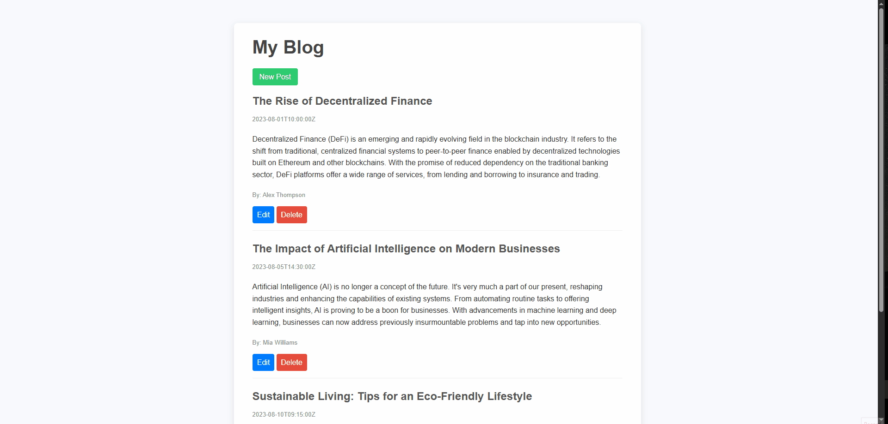

# 📖 blog-api


This project is a simple **blog platform** with two backends:  

- A **website server backend** running on `http://localhost:3000` that serves the user interface for the blog.  
- An **API backend** running on `http://localhost:4000` that handles all data operations for blog posts.

The website allows users to:  

- View all blog posts  
- Read individual posts  
- Create new posts  
- Edit existing posts  
- Delete posts  

The website dynamically fetches and manages blog data through the API backend. All post data is currently stored in memory, so it resets when the API server restarts.  

This platform demonstrates a clear separation between the frontend (website server) and backend (API server), and can be extended to use a persistent database for long-term storage.

---

## 🎞️ Demo




---

## 🚀 Features

- Full **CRUD operations** for blog posts  
- Dynamic rendering of posts on the website  
- Separate backend for API to handle data  
- Easy to extend with a database for persistence  

---

## 🛠️ Installation

### 1. Clone the repository
```bash
git clone https://github.com/pouriavj/blog-api.git
cd blog-api
```
### 2. Install dependencies
```bash
npm install
```
### 3. Start the API backend
Open a terminal and run:
```bash
node index.js
```
API available at http://localhost:4000.
### 4. Start the Website server backend
Open another terminal and run:
```bash
node server.js
```
Website available at http://localhost:3000.

---

## 🌐 How it works

- The **website server** provides the user interface and pages for viewing, creating, and editing blog posts.  
- The **API backend** provides endpoints for all data operations. The website communicates with the API to fetch, create, update, and delete posts.  
- Posts are stored in memory on the API backend, so restarting the server will clear all data.  

---

## 🧩 Notes

- Designed to demonstrate **frontend-backend separation**  
- Can be extended to use a **persistent database** (e.g., MongoDB)  
- Ideal as a learning project for building RESTful APIs and dynamic websites

---

## 🛠️ Built With

- [Node.js](https://nodejs.org/) – JavaScript runtime for the backend  
- [Express.js](https://expressjs.com/) – Web framework for API and website server  
- [EJS](https://ejs.co/) – Templating engine for rendering frontend pages  
- [HTML & CSS](https://developer.mozilla.org/en-US/docs/Web) – Basic structure and styling for the website  


